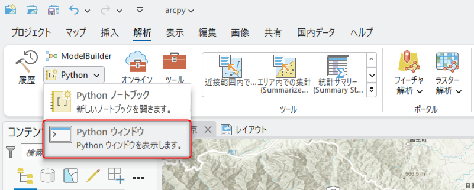
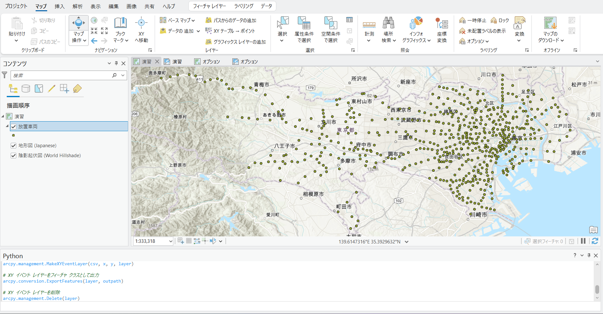
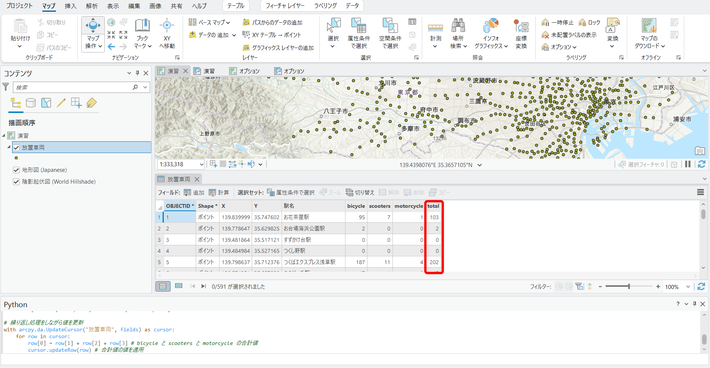
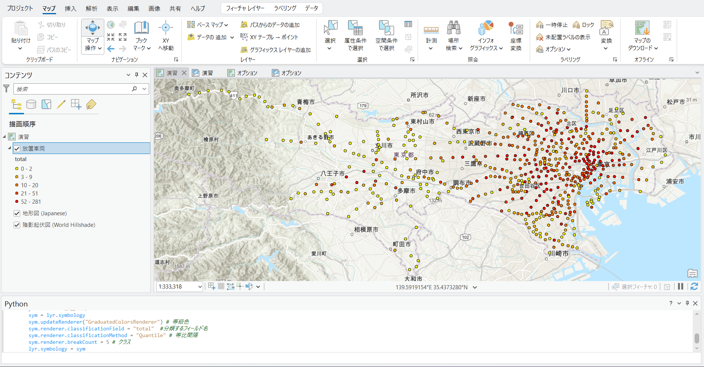
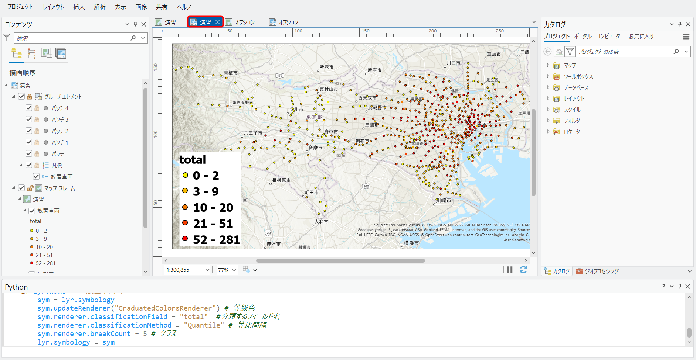
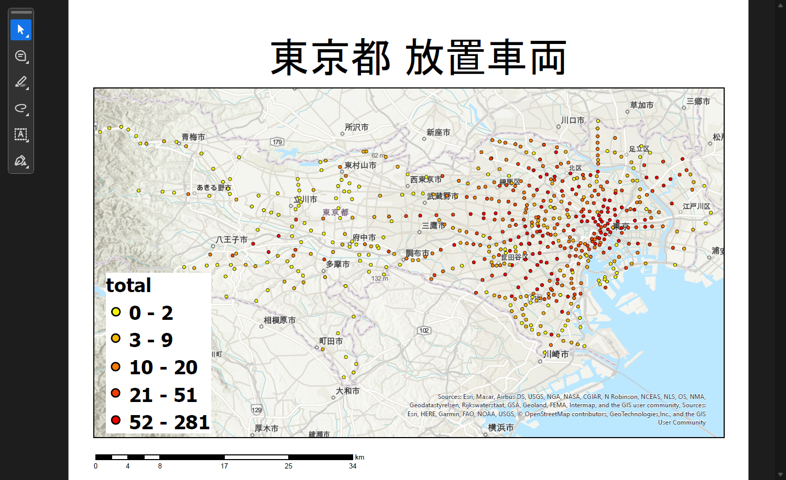
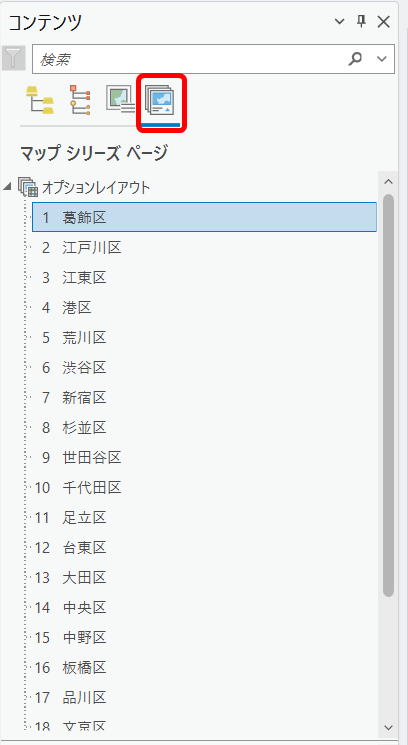

# BP 最新情報セミナー2025　Python で ArcGIS Pro を使ってみよう：ArcPy ハンズオン

## 概要
このガイドは ArcPy を使用した、データの作成からマップのエクスポートまでの操作の流れを紹介します。

## プロジェクトの準備
1. [ハンズオンで使用するデータ](https://github.com/ej-ambo/workshops/raw/refs/heads/main/20250418_arcpy-hands-on/HandsOn/data.zip) をダウンロード、解凍し、data フォルダーを任意の場所に配置してご活用ください。※スクリプト内では C ドライブ直下を指定しています。

2. 1 でダウンロードした、data/ArcGISPro フォルダに格納されている arcpy.aprx を開きます。サイン イン画面が表示された場合はお手持ちのアカウントでサイン インしてください。開き終わったら「演習」マップが開いているか確認してください。

3. [解析] タブ ＞ [Python] ＞ [Python ウィンドウ] をクリックします。ArcGIS Pro の画面下方に Python ウィンドウが表示されます。この後の演習ではこの Python ウィンドウにコードを入力していきます。



## 演習 1 : ジオプロセシング ツールの実行

ジオプロセシング ツールを使用して、CSV ファイルから ArcGIS Pro にデータを取り込みます。

1. 下記のコードを Python ウィンドウに入力し、Enter キーを 2 回押下して実行します。データの配置場所に応じてパスを書き換えてください。

```Python
# ArcPy サイト パッケージをインポート
import arcpy

# ジオプロセシング ツールで利用する変数を定義
csv = r"C:\data\HandsOn.csv"
x = "X"
y = "Y"
layer = "PointLayer"
outpath = r"C:\data\ArcGISPro\arcpy.gdb\放置車両"

# CSV ファイルから XY イベント レイヤー（テンポラリのオブジェクト）を作成
arcpy.management.MakeXYEventLayer(csv, x, y, layer)

# XY イベント レイヤーをフィーチャ クラスとして出力
arcpy.conversion.ExportFeatures(layer, outpath)

# XY イベント レイヤーを削除
arcpy.management.Delete(layer)
```

実行が完了すると下記のような結果になります。



上記のコードではまず、import arcpy により ArcPy サイトパッケージをインポートします。これにより ArcGIS Pro が持つ機能を使用できるようになります。

次にジオプロセシング ツールで利用する変数の定義で、CSV ファイルのパス (csv)、CSV ファイル内の緯度経度が示されている列名 (x,y)、作成するレイヤー名 (layer)、ポイントデータを配置するパス (outpath) を指定します。

[XY イベント レイヤーの作成](https://pro.arcgis.com/ja/pro-app/latest/tool-reference/data-management/make-xy-event-layer.htm) ツールを実行し、CSV ファイルの X,Y からポイントデータを作成します。
作成されたレイヤーは一時的なデータのため、[フィーチャのエクスポート](https://pro.arcgis.com/ja/pro-app/3.3/tool-reference/conversion/export-features.htm) ツールでフィーチャクラスとして出力します。
最後に不要となったイベント レイヤーを [削除](https://pro.arcgis.com/ja/pro-app/latest/tool-reference/data-management/delete.htm) ツールで削除しています。


今回使用する CSV ファイルには東京都内の各駅における緯度経度や各種放置車両台数が記載されています。
CSV から緯度経度を参照し、「放置車両」という名前で、ポイント データを生成しています。


## 演習 2 : テーブルの操作 (カーソル)

演習 1 で作成したポイント データを編集します。

1. コンテンツ ウィンドウで 放置車両 フィーチャレイヤーを右クリック → 属性テーブルをクリックします。

    属性テーブルが開き、各駅名と各駅ごとの放置車両台数 (bicycle, scooters, motorcycle) が含まれていることが確認できます。


2. 下記のコードを Python ウィンドウに入力し、Enter キーを 2 回押下して実行します。

```Python
# フィーチャクラスに LONG 型の total フィールドを追加
arcpy.management.AddField("放置車両","total","LONG")

# フィーチャクラスから取得するフィールド名のリストを作成
fields = ['total', 'bicycle', 'scooters', 'motorcycle']

# 繰り返し処理をしながら値を更新
with arcpy.da.UpdateCursor("放置車両", fields) as cursor:
    for row in cursor:
        row[0] = row[1] + row[2] + row[3] # bicycle と scooters と motorcycle の合計値
        cursor.updateRow(row) # 合計値の値を適用
```

上記のコードでは、演習 1 で作成した放置車両のフィーチャクラスに、[フィールドの追加](https://pro.arcgis.com/ja/pro-app/latest/tool-reference/data-management/add-field.htm) ツールで、放置車両台数の合計値を格納するフィールド (total) を作成しています。
この total は、bicycle、scooters、motorcycle の三項目の合計値となります。

[UpdateCursor クラス](https://pro.arcgis.com/ja/pro-app/latest/arcpy/data-access/updatecursor-class.htm) を使用して、フィーチャクラスの各行 (1 つ 1 つのフィーチャ) に対して合計値を適用する繰り返し処理を行っています。

3. 再度コンテンツ ウィンドウで 放置車両 フィーチャ レイヤーを右クリックし、属性テーブルを開きます。

    tolal フィールドに、各項目の合計値が追加されていることが確認できます。



## 演習 3 : シンボルの更新

演習 2 で追加した放置車両台数の合計値を用いて、シンボルを更新します。

1. 下記のコードを Python ウィンドウに入力し、Enter キーを 2 回押下して実行します。

```Python
# 現在開いているプロジェクト ファイルのオブジェクトを取得
aprx = arcpy.mp.ArcGISProject("CURRENT")

# マップのオブジェクト取得
maps = aprx.listMaps("演習")[0]

# レイヤーのオブジェクト取得
lyrs =maps.listLayers()

# 放置車両レイヤーのシンボル更新
for lyr in lyrs:
    if lyr.name == "放置車両":
        sym = lyr.symbology
        sym.updateRenderer("GraduatedColorsRenderer") # 等級色
        sym.renderer.classificationField = "total"  #分類するフィールド名
        sym.renderer.classificationMethod = "Quantile" # 等比間隔
        sym.renderer.breakCount = 5 # クラス
        lyr.symbology = sym
```

上記のコードでは、[Symbology クラス](https://pro.arcgis.com/ja/pro-app/latest/arcpy/mapping/symbology-class.htm) を使用して演習 2 で追加した total フィールドの属性値に応じてシンボルを設定しています。
今回は等級色 (GraduatedColorsRenderer) を使用し、total フィールドに対して、5 段階の等比間隔 (Quantile) で分類をしています。



##### 補足
ArcPy のサンプル コードや Web ヘルプを見る時に ArcGIS Pro を参考にできる場合があります。演習 3 の「GraduatedColorsRenderer」の場合では、リファレンスの各プロパティがシンボル設定画面のある項目に対応しているという見方ができます。

<table>
  <tr>
    <td>breakCount：クラス</td> <td rowspan="4"	<p></p></td>
  </tr>
  <tr>
    <td>classificationField：フィールド</td> 
  </tr>
  <tr>
    <td>classificationMethod：方法</td>
  </tr>
  <tr>
    <td>colorRamp：配色</td>
  </tr>
</table>


## 演習 4 : マップを PDF にエクスポート

これまでの演習で作成したマップを PDF ファイルにエクスポートします。

1. マップ上部の「演習」 レイアウト タブをクリックして、レイアウト ビューに切り替えます。
    
   今回はあらかじめレイアウトを作成しています。このレイアウトを使用して PDF にエクスポートします。
    


2. 下記のコードを Python ウィンドウに入力し、Enter キーを 2 回押下して実行します。データの配置場所に応じて出力先のパスを書き換えてください。

```Python
# プロジェクト ファイルのオブジェクト取得
aprx = arcpy.mp.ArcGISProject("CURRENT")

# レイアウトを取得
layout = aprx.listLayouts("演習")[0]

#　ページ レイアウト設定内容を PDF へ出力
layout.exportToPDF(r"C:\data\output\Sample.pdf")
```

上記のコードでは、プロジェクト内のレイアウトに対して、[Layout クラス](https://pro.arcgis.com/ja/pro-app/latest/arcpy/mapping/layout-class.htm) の exportToPDF メソッドを使用して PDF ファイルに出力をしています。

3. 出力先に Sample.pdf がエクスポートされたことを確認します。




## オプション　マップ シリーズの利用

演習 4 では地図全体を 1 つの PDF として出力しました。
[マップ シリーズ](https://pro.arcgis.com/ja/pro-app/latest/help/layouts/map-series.htm)を利用すると、自分が気になる範囲を抽出してまとめて PDF などのファイルに出力できます。
この演習では範囲を指定するフィーチャ レイヤーを利用したマップ シリーズを紹介します。

ここではあらかじめマップ シリーズを適用した「オプション」という名前のマップとレイアウトを使用します。

「オプション」マップには、放置車両のデータと、マップ シリーズの定義に使用するための東京 23 区のポリゴン レイヤーが表示されています。
「オプション」レイアウトには、事前にレイアウトとマップ シリーズが設定されています。

1. 「オプション」レイアウトを開き、コンテンツ ウィンドウから マップ シリーズ ページを表示し、東京 23 区の各区がマップ シリーズに設定されていることを確認する。



2. 下記のコードを Python ウィンドウに入力し、Enter キーを 2 回押下して実行します。

```Python
# プロジェクト ファイルのオブジェクト取得
aprx = arcpy.mp.ArcGISProject("CURRENT")
 
# レイアウトを取得
layout = aprx.listLayouts("オプション")[0]
 
# レイアウトからマップ シリーズを取得
ms = layout.mapSeries
 
# マップ シリーズのエクスポート
ms.exportToPDF(r"C:\data\output\mapseries.pdf")
```

マップ シリーズ プロパティはレイアウトにマップ シリーズが設定されている時にアクセスすることができます。
上記のコードではレイアウトのマップ シリーズ プロパティにアクセスし、マップ シリーズに対して exportToPDF メソッドを使用して各区ごとに出力します。


実行が終わると、「output」フォルダーに東京 23 区のマップがまとまった PDF が作成されます。

**完成例**


このようにして、事前に作成した範囲についてまとめてマップを出力することができます。

この演習では範囲を示すポリゴン レイヤーを使用しましたが、ブックマークや図郭レイヤーも使用可能なので、詳しく知りたい方は[マップ シリーズのヘルプ](https://pro.arcgis.com/ja/pro-app/latest/help/layouts/map-series.htm)を参照してください。
